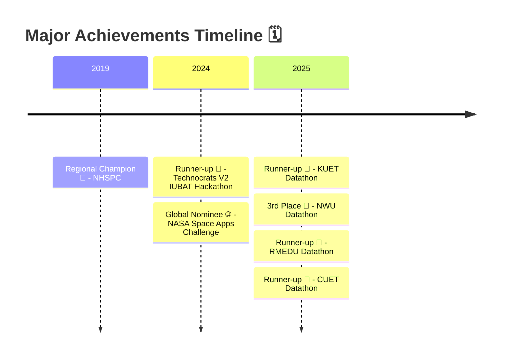

### Visit My Profile : https://syed-nazmus-sakib.github.io/

  

  

# 👨‍💻 About Me

I'm a passionate researcher and student deeply immersed in the world of **Robotics and Mechatronics Engineering** at the **University of Dhaka**. My drive stems from a fascination with intelligent systems and automation. I'm actively engaged in multiple roles:

- 🎓 **Undergrad** at **Robotics and Mechatronics Engineering**, University of Dhaka
- 🔬 **Research Intern** at **Data and Design Lab, CARS (Centre for Advanced Research in Sciences)**
- 🛠️ **R&D Engineer** at **Tech Topia**
- 📊 Active Competitor in **Kaggle Competitions**

  

# 🛠️ Tech Stack & Skills

  <table border="0" cellspacing="0" cellpadding="0">
    <tr>
      <td align="center" width="50%">
        <b> Languages</b>
      </td>
      <td align="center" width="50%">
        <b> Frameworks & Libraries</b>
      </td>
    </tr>
    <tr>
      <td align="center">
        
        
        
        
        
      </td>
      <td align="center">
        
        
        
        
        
        
      </td>
    </tr>
    <tr>
      <td align="center">
        <b> ML / DL & Viz Tools</b>
      </td>
      <td align="center">
        <b> DevOps & Robotics</b>
      </td>
    </tr>
    <tr>
      <td align="center">
        
        
        
        
      </td>
      <td align="center">
        
        
        
        
      </td>
    </tr>
  </table>

  

# 🔗 Connect With Me

  
  
  
  
  

    

  

  

# 📄 Publications

> All papers currently **Under Review**

<table align="center" border="0" cellspacing="0" cellpadding="12" width="100%">

  <tr>
    <td width="6%" align="center"><b>01</b></td>
    <td>
      <b><a href="https://arxiv.org/pdf/2602.05354">PATHWAYS: Evaluating Investigation and Context Discovery in AI Web Agents</a></b> 
      📍 Under Review — <i>ICML 2026</i>
    </td>
  </tr>

  <tr>
    <td width="6%" align="center"><b>02</b></td>
    <td>
      <b><a href="https://openreview.net/pdf?id=9PtO3zbwQM">Thinking Like a Botanist: Challenging Multimodal Language Models with Intent Driven Chain-of-Inquiry</a></b> 
      📍 Under Review — <i>ACL 2026</i>
    </td>
  </tr>

  <tr>
    <td width="6%" align="center"><b>03</b></td>
    <td>
      <b><a href="https://arxiv.org/pdf/2508.17117">PlantVillageVQA: A Visual Question Answering Dataset for Benchmarking Vision-Language Models in Plant Science</a></b> 
      📍 Under Review — <i>Nature Scientific Data</i> &nbsp;|&nbsp; IF: 8.2
    </td>
  </tr>

  <tr>
    <td width="6%" align="center"><b>04</b></td>
    <td>
      <b><a href="https://arxiv.org/pdf/2508.17107">SugarcaneShuffleNet: A Very Fast, Lightweight Convolutional Neural Network for Diagnosis of 15 Sugarcane Leaf Diseases</a></b> 
      📍 Under Review — <i>Computers and Electronics in Agriculture</i> &nbsp;|&nbsp; IF: 8.9
    </td>
  </tr>

  <tr>
    <td width="6%" align="center"><b>05</b></td>
    <td>
      <b>Predicting Groundwater Recharge Potential across Various Physiographic Divisions of Bangladesh using Generative Data Augmentation</b> 
      📍 Under Review — <i>Journal of Hydrology</i>
    </td>
  </tr>

</table>

  

# 🏆 Competitions & Achievements

